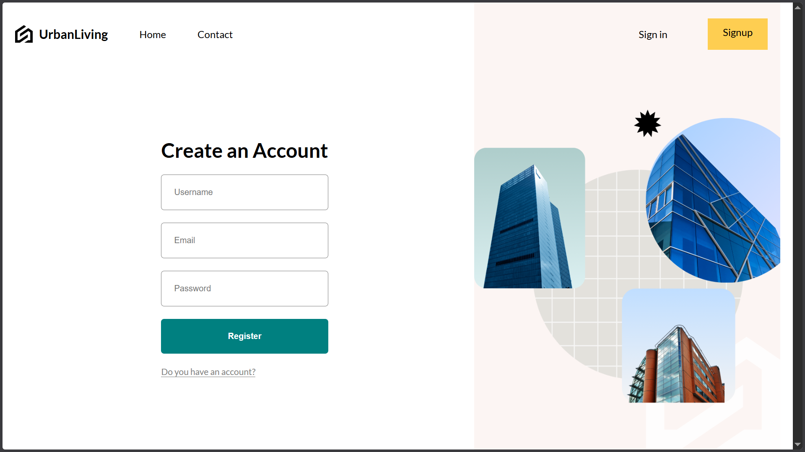
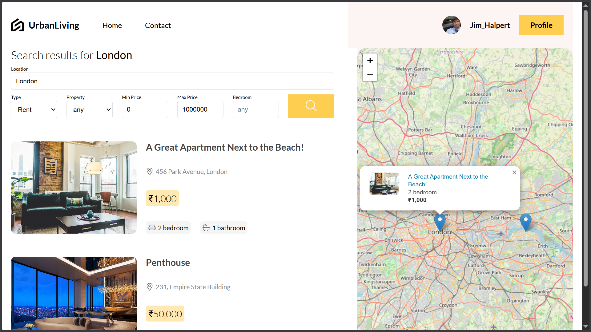
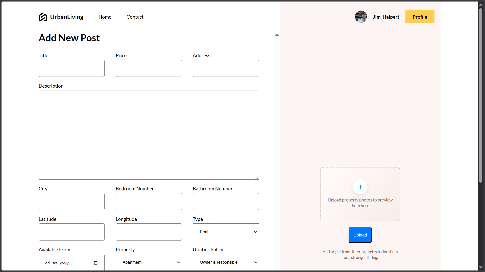
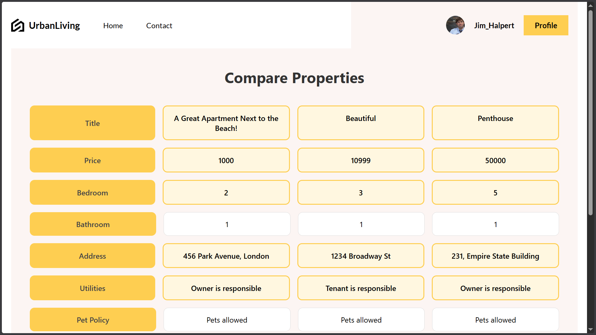
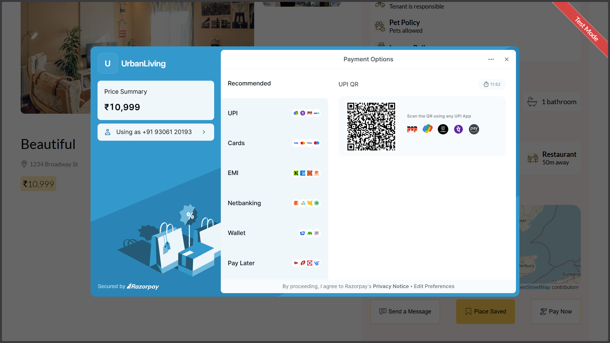
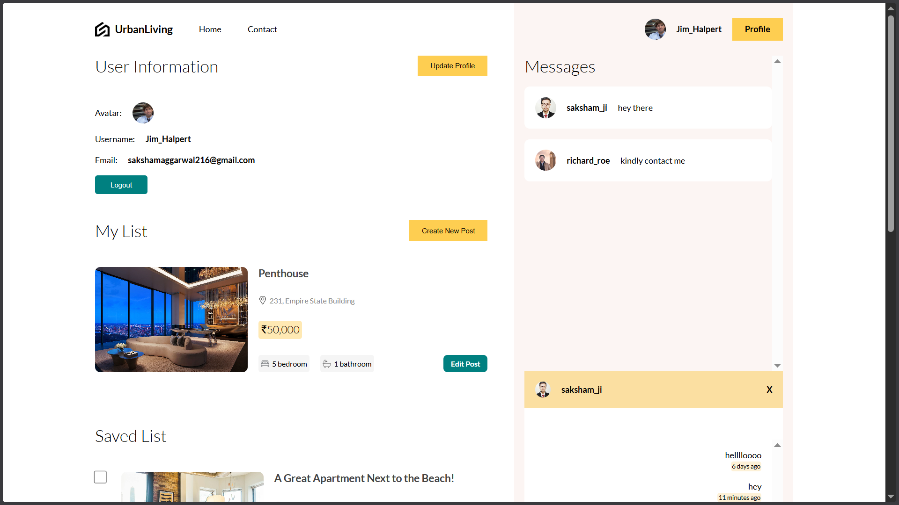

# UrbanLiving Real Estate Platform

UrbanLiving is a full-stack real estate marketplace where users can browse property listings, search and filter by location and price, save and compare properties, chat with owners in real time, and publish or update their own listings. The project is built as a monorepo with separate frontend, backend API, and socket services.

## Features

- User registration and login with JWT cookie-based authentication
- Property listing creation, editing, browsing, and deletion
- Search, filtering, and map-based property discovery
- Saved properties, bought properties, and compare view
- Real-time buyer-seller chat using Socket.IO
- Cloudinary image uploads for avatars and property photos
- Razorpay payment order integration for property purchase flow

## Tech Stack

### Frontend

- React
- Vite
- React Router DOM
- Axios
- Zustand
- React Leaflet / Leaflet
- React Toastify
- Sass

### Backend

- Node.js
- Express
- Prisma ORM
- MongoDB
- JWT
- bcrypt
- Razorpay SDK

### Realtime

- Socket.IO

## Project Structure

```text
RealEstate/
├── api/        # Express API + Prisma + MongoDB
├── Frontend/   # React frontend
├── socket/     # Socket.IO server
└── README.md
```

## Screenshots

### 1. Signup / Register



### 2. Property Search & Listings



### 3. Add New Property Post



### 4. Compare Properties



### 5. Payment Checkout



### 6. Chat Interface



## Setup Instructions

### 1. Clone the repository

```bash
git clone <your-repo-url>
cd RealEstate
```

### 2. Backend setup

Copy `api/.env.example` to `api/.env` and fill in your values:

```env
DATABASE_URL="your_mongodb_connection_string"
JWT_SECRET_KEY="your_jwt_secret"
CLIENT_URL="http://localhost:5173"
PORT=8800
NODE_ENV=development
RAZORPAY_KEY_ID="your_razorpay_key_id"
RAZORPAY_KEY_SECRET="your_razorpay_key_secret"
```

Install and run:

```bash
cd api
npm install
npx prisma generate
npm run dev
```

### 3. Frontend setup

Copy `Frontend/.env.example` to `Frontend/.env` and fill in your values:

```env
VITE_API_BASE_URL="http://localhost:8800"
VITE_SOCKET_URL="http://localhost:4000"
VITE_RAZORPAY_KEY="your_razorpay_key_id"
```

Install and run:

```bash
cd Frontend
npm install
npm run dev
```

### 4. Socket server setup

Copy `socket/.env.example` to `socket/.env`:

```env
PORT=4000
FRONTEND_URL="http://localhost:5173"
```

Install and run:

```bash
cd socket
npm install
node app.js
```

## Running the Project

Run all three services in separate terminals:

- Backend API: `http://localhost:8800`
- Frontend: `http://localhost:5173`
- Socket server: `http://localhost:4000`

## Payment Setup

To enable payments:

- create a Razorpay account
- generate test API keys
- add them to `api/.env` and `Frontend/.env`
- make sure the payment route is enabled in `api/app.js`

## Notes

- MongoDB Atlas is recommended if local MongoDB replica set setup is not available.
- Cloudinary upload presets must be valid for avatar and property image uploads to work.
- The backend uses protected routes for post creation, editing, saving, chat, and profile operations.

